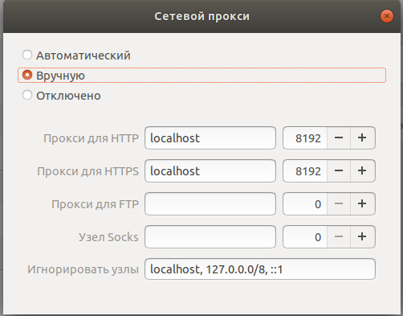
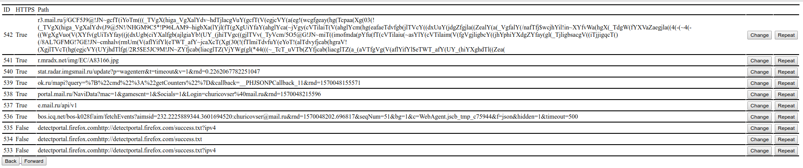

# proxy-server
HTTP(S) proxy server on GoLang for "Web Security" course in Technopark mail.ru

## Requirements:
 [x] HTTP proxy
 [x] HTTPS proxy
 [x] Burp repeater

---
## Docker installation
```sh
git clone https://github.com/moguchev/proxy-server.git
sudo docker rm $(sudo docker ps -a -q)
sudo docker-compose up --build
```

---
## Manual installation
   Requires:
   * golang 1.12+
   * go mod
   * postgresql

1. 
```sh
git clone https://github.com/moguchev/proxy-server.git
```
2. Create user in postgres(optional)
3. Create database (internal/database/schema.sql)
4. Write your config in files _./##_config.json_
5. 
```sh
go run ./cmd/proxy/main.go ./local_proxy_config.json
go run ./cmd/repeater/main.go ./local_repeater_config.json
```
---


## Settings
  * configure proxy request forwarding
    Example for _Ubuntu_:
    Settings->Network->Network Proxy->Manual
    
  * Import certificate _ca-cert.crt_ into your browser(Recommended to use Mozilla Firefox)
---

## Burp repeater

### GUI
   Open in your browser http://localhost:8193
   

### Note
If you can't kill docker containers do:
```sh
$ sudo systemctl daemon-reload
$ sudo systemctl restart docker
```